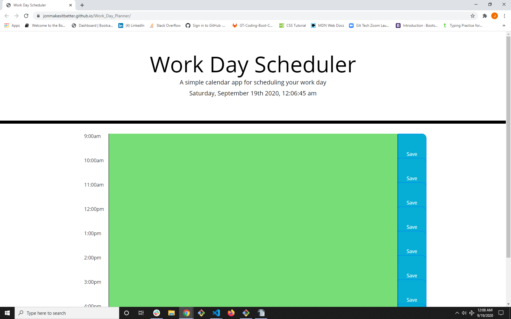

# Work_Day_Planner

This application is a simple day planner in which notes can be made and will 
persist even when the page is refreshed. Time blocks area color-coded by past,
present, and future, and the current date and time are displayed at the top
of the page.

# Usage

This application is used by clicking in the center block between the save button and the corresponding time on the left.
The user then types any notes they wish and after clicking the save button corresponding to the text block, those notes
will persist even after the page is refreshed.

Link: 
[Work_Day_Planner](https://jonmakesitbetter.github.io/Work_Day_Planner/)

## Credits

Special thanks to Brandon Walker, Jude Clarke, Shahmir Farooqui, Jada Arnett, and Nathan Calle for their help and support
during study sessions. They helped me to understand the code and thus, this program was possible. 

Credit is also due the following websites:
https://www.w3schools.com/
https://api.jquery.com/

## License

© Jonathan Peach, 2020